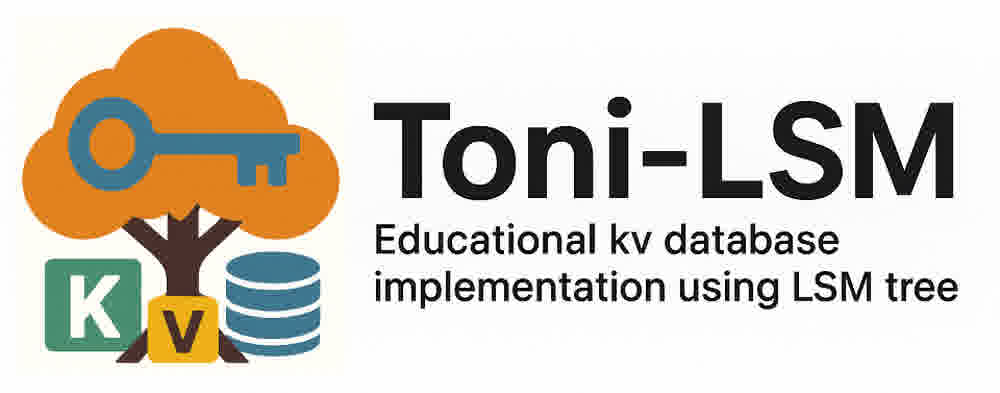

# Toni-LSM Lab

----

# 0 Toni-LSM是什么?
[Toni-LSM](https://github.com/ToniXWD/toni-lsm)是一个基于`LSM Tree`的开源教学`KV`存储引擎, 除`LSM Tree`的基础功能外, 还支持`MVCC`、`WAL`、崩溃恢复、`Redis`兼容等功能。本实验是基于作者原本实验的代码进行改造后的`Lab`课程。

### ⭐ 请支持我们的项目！
> 如果您觉得本`Lab`不错, 请为[Toni-LSM](https://github.com/ToniXWD/toni-lsm)点一个⭐。项目实验制作耗费了我很大精力，作者非常需要您的鼓励❤️, 您的支持是我更新的动力😆

# 1 本实验的目的是什么?
本实验的最终目标是实现一个基于`LSM Tree`的单机`KV Store`引擎。其功能包括:
1. 基本的`KV`存储功能，包括`put`、`get`、`remove`等。
2. 持久化功能，构建的存储引擎的数据将持久化到磁盘中。
3. 事务功能，构建的存储引擎将支持`ACID`等基本事务特性
4. `MVCC`, 构建的存储引擎将支持`MVCC`对数据进行查询。
5. `WAL`与崩溃恢复, 数据写入前会先预写到`WAL`日志以支持崩溃恢复
6. `Redis`兼容, 本实验将实现`Redis`的`Resp`兼容层, 作为`Redis`后端。

# 2 本实验适合哪些人？
通过本实验，你可以学习到`LSM Tree`这一工业界广泛使用的`KV`存储架构, 适合数据库、存储领域的入门学习者。同时本实验包含了`Redis`的`Resp`协议兼容层、网络服务器搭建等内容，也适合后端开发的求职者。同时，本项目使用`C++ 17`特性, 使用`Xmake`作为构建工具，并具备完善的单元测试，也适合想通过项目进一步学习现代`C++`的同学。

# 3 本实验的前置知识？
本项目的知识包括：
1. **(必备)**: 到`C++17`为止的常见`C++`新特性，（项目的配置文件指定的标准为`C++20`, 但其只在单元测试中使用, 项目核心代码只要求`C++17`即可）
2. **(必备)**：常见的数据结构与算法知识
3. **(建议)**: 数据库的基本知识，包括事务特性、`MVCC`的基本概念
4. **(建议)**: `Linux`系统编程知识，本实验使用了系统底层的`mmap`等IO相关的系统调用
5. **(可选)**：`Xmake`的使用, 本实验的构建工具为[`Xmake`](https://xmake.io/#/zh-cn/), 若你想自定义单元测试或引入别的库, 需要手动在`Xmake`中配置。
6. **(可选)**: `Redis`基本知识, 本实验将利用`kv`存储接口实现`Redis`后端, 熟悉`Redis`有助于实验的理解。
7. **(可选)**: 单元测试框架`gtest`的使用, 如果你想自定义单元测试, 需要自行改配置。

# 4 LSM Tree 简介
在具体进入本实验之前，我们先来简单介绍`LSM Tree`。

`LSM Tree`是一种`KV`存储架构。其核心思想是，将`KV`存储的数据以`SSTable`的形式进行持久化，并通过`MemTable`进行内存缓存，当`MemTable`的数据量达到一定阈值时，将其持久化到磁盘中，并重新创建一个`MemTable`。`LSM Tree`的核心思想是，将`KV`存储的数据以`SSTable`的形式进行持久化，并通过`MemTable`进行内存缓存。并且， 数据以追加写入的方式进行，删除数据也是通过更新的数据进行覆盖的方式实现。

如图所示为`LSM Tree`的核心架构。我们通过`Put`, `Remove`和`Get`操作的流程对其进行介绍。

## 4.1 Put 操作流程
`Put`操作流程如下：
1. 将`Put`操作的数据写入`MemTable`中
   1. `MemTable`中包括多个键值存储容器(本项目是采用的跳表`SkipList`)
      1. 其中有一份称为`current_table`, 即活跃跳表, 其可读可写
      2. 其余的多份跳表均为`frozen_tables`, 即即冻结跳表, 其只能进行读操作
   2. `Put`的键值对首先插入到`current_table`中
      1. 如果`current_table`的数据量未达到阈值, 直接返回给客户端
      2. 如果`current_table`的数据量达到阈值, 则将`current_table`被冻结称为`frozen_tables`中的一份, 并重新初始化一份`current_table`
2. 如果前述步骤导致了新的`frozen_table`产生, 判断`frozen_table`的容量是否超出阈值
3. 如果超出阈值, 则将`frozen_table`持久化到磁盘中, 形成`SST`(全程是`Sorted String Table`), 单个`SST`是有序的。
   1. `SST`按照不同的层级进行划分, 内存中的`MemTable`刷出的`SST`位于`Level 0`, `Level 0`的`SST`是存在重叠的。（例如`SST 0`的`key`范围是`[0, 100)`, `SST 1`的`key`范围是`[50, 150)`, 那么`SST 0`和`SST 1`的`key`在`50, 100)`范围是重叠的, 因此无法在整个层级进行二分查询）
   2. 当`Level 0`的`SST`数量达到一定阈值时, 会进行`Level 0`的`SST`合并, 将`SST`进行`compact`操作, 新的`SST`将放在`Level 1`中。同时，为保证此层所有`SST`的`key`有序且不重叠, `compact`的`SST`需要与原来`Level 1`的`SST`进行重新排序。由于`compact`时将上一层所有的`SST`合并到了下一层, 因此每层单个`SST`的容量是呈指数增长的。
   3. 当每一层的`SST`数量达到一定阈值时, `compact`操作会递归地向下一层进行。

## 4.2 Remove 操作流程
由于`LSM Tree`的操作是追加写入的, 因此`Remove`操作与`Put`操作本质上没有区别, 只是`Remove`的`value`被设定为空以标识数据的删除。

## 4.3 Get 操作流程
`Get`操作流程如下:
1. 先在`Memtable`中查找, 如果找到则直接返回。
   1. 优先查找活跃跳表`current_table`
   2. 其次尝试查找`frozen_tables`, 按照`id`倒序查找(因为`id`越小, 表示`SkipList`越旧)
2. 如果在`Memtable`中未找到, 则在`SST`中查找。
   1. 先在`Level 0`层查找, 如果找到则直接返回。注意的是, `Level 0`层不懂的`SST`没有进行排序, 因此需要按照`SST`的`id`倒序逐个查找(因为`id`越小, 表示`SST`越旧, 优先级越低)
   2. 随后逐个在后面的`Level`层查找, 此时所有的`SST`都已经进行过排序, 因此可在`Level`层面进行二分查询。
3. 如果`SST`中为查询到, 返回。

至此，你对`LSM Tree`的`CRUD`操作流程有了一个初步的印象, 如果你现在看不懂的话, 没关系。后续的`Lab`中会对每个模块有详细的讲解。

# 5 实验流程
本实验的组织类似[`CMU15445 bustub`](https://github.com/cmu-db/bustub), `Lab`提供了整体的代码框架, 并将其中某些组件的关键函数挖空并标记为`TODO`, 参与`Lab`的同学需要按照每一个`Lab`的指南补全缺失的函数, 并通过对应的单元测试。

同样类似`CMU 15445`, 后面的`Lab`依赖于前一个`Lab`的正确性, 而实验提供的单元测试知识尽量考虑到了各种边界情况, 但不能完全确保你的代码正确, 因此必要时, 你需要自行进行单元测试补充以及`debug`。

> 在目前的`Lab`中, 你确实可以从原仓库[Toni-LSM](https://github.com/ToniXWD/toni-lsm)的`complete`分支直接查看`Lab`实验的答案, 但作者不希望你如此做, 这样你将无法深刻理解实验设计的思路和相关知识。

在了解完这些以后, 你可以开启下一章[Lab 0 环境准备](./lab0-env.md)的学习。

# 6 项目交流与讨论
如果你对本`Lab`有疑问, 欢迎在[GitHub Issues](https://github.com/ToniXWD/toni-lsm/issues)中提出问题。也欢迎加入次实验的[QQ讨论群](https://qm.qq.com/q/wDZQfaNNw6) 。如果你想参与`Lab`的开发, 欢迎通过QQ群或者作者邮件: xwdtoni@126.com 联系。