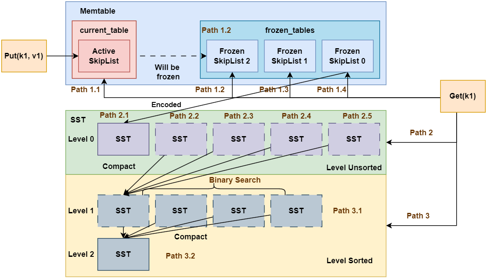

# 1 概述
这一章的开头我们再次搬出我们的经典架构图:

通过[Lab1](../lab1/lab1-skiplist.md)和[Lab2](../lab2/lab2-memtable.md)的学习，我们已经初步完成了`LSM Tree`中内存的基础读写组件, 这一章我们将眼光从内存迁移到磁盘, 实现`SST`相关的内容。

从架构图中我们知道，`SST`文件是`LSM Tree`中持久化的存储文件，其中`Level 0`的`SST`存储了`MemTable`中单个`Skiplist`的数据，并且提供了`LSM Tree`中数据的有序性。因此对于一个磁盘中的文件, 我们肯定需要实现文件的编解码设计。其中编码设计用于将内存的`Skiplist`类的实例转化为`SST`文件, 而读取`SST`中的某些键值对时我们需要将文件进行解码并读取数据到内存。因此这一章中编解码是一大主题内容。而且相对之前常驻内存的`MemTable`而言, 这里的编解码代码的实现更为复杂, 尤其是`Debug`难度比之前要大上不少。

此外，我们从架构图中还了解到，不同`Level`的`SST`是需要再容量超出阈值时进行合并(`Compact`)的, 但`Compact`在本实验中是由更上层的控制结构实现的, 因此本节实验你不需要担心`Compact`, 这是后续`Lab`的内容, 这里提一嘴只是为了有助于从理论上理解其运行机制。

# 2 SST 的结构
从架构图中我们了解到，不同`Level`之间的容量呈指数增长, 其中最小的`Level 0`的`SST`也是`SkipList`的大小, 而`SkipList`实例在内存中是由多个链表组成的, 查询速度基本上和红黑树差不多。但假若我们想从`SST`中查一个键值对，总不可能把整个`SST`都解码放到内存中吧? 要知道高层`Level`的`SST`是可以轻易增长到`GB`的大小的。因此，`SST`必须进行内部的切分, 这里切分形成的一块数据我们称之为`Block`。因此对`Block`的组织管理就是`SST`设计的核心内容。`Toni-LSM`的`SST`文件结构如下:

`SST`文件由多个`Block`组成，每个`Block_x`内部暂且看成一个黑箱, 只需要知道其是我们查询的基本IO单元即可。 每个`Block_x`后会追加32位的哈希值，用于校验。每个`Block`对应一个`Meta`, 每个`Meta`记录这个`Block`在`SST`文件中的偏移量、第一个和最后一个`key`的元数据(长度和大小)。

这里，`Block`是基本的IO单元，这就意味着在查询一个`key`时, 其所在的整个`Block`的数据都会被解码并加载到内存中的。你可以类比操作系统中的`Page`, 其是内存和磁盘之间的基本IO单元。

另一方面，在查询一个`key`时，如何确定查哪一个`Block`呢? 这里就需要将`SST`中的`Extra Information`中的元数据提前加载到内存中, 这些元数据能够定位到`Meta Section`, 而`Meta Section`是一个数组, 其中每个`Meta_x`记录了对应`Block`在整个`SST`中的位置， 可以以此来快速对指定为位置的二进制数据进行解码。

> 你肯定能想到, 作为基本的IO单元, 我们肯定会为其实现一个缓存池的, 这样可以避免每次查询时都进行磁盘IO。

心细的你肯定也注意到, 这里有一个`Bloom Section`, 这其实就是布隆过滤器中的`bit`位数组, 其用处是拦截无效的访问, 这会在后续的`Lab`中进行详细讲解。

# 3 Block的结构
现在我们来看`Block`的结构, `Block`是`SST`中的基本IO单元，即`SST`的每个查询最终是在`Blcok`中定位到具体的键值对的, 其结构为:

> 上图的`B`表示一个字节

一个`Block`包含:`Data Section`、`Offset Section`和`Extra Information`三部分:
- `Data Section`: 存放所有的数据, 也就是`key`和`value`的序列化数据
  - 每一对`key`和`value`都是一个`Entry`， 编码信息包括`key_len`、`key`、`value_len`和`value`
    - `key_len`和`value_len`都是`2B`的`uint16_t`类型, 用于表示`key`和`value`的长度
    - `key`和`value`就是对应长度的字节数, 因此需要用`varlen`来表示。
- `Offset Section`: 存放所有`Entry`的偏移量, 用于快速定位
- `Extra Information`: 存放`num_of_elements`, 也就是`Entry`的数量

这样编码满足了最基本的要求, 从最后的2个字节可以知道`Block`包含了多少`kv`对, 再从`Offset Section`中查询对应的`kv`对数据的偏移。

# 4 思考
现在有了`Block`和`SST`的设计方案, 你可以思考如下几个问题:

1. `Blcok`和`SST`是如何构建的? `Block`如何进行划分?
2. `Block`内部如何实现迭代器吗? 
3. `SST`的迭代器是单独设计, 还是对已有`Blcok`迭代器的封装? 如何封装?
4. `Block`的缓存池如何设计?
5. 布隆过滤器和缓存池的设计各自有什么作用? 他们的功能是否重复?

当你对上述问题有过简单思考后, 你可以开启本次`Lab`了, 你需要有一定心理准备, 这一大章节的`Lab`原比之前的`MemTable`和`Skiplist`复杂, 现在开始第一部分 [Block 实现](./lab3.1-Block.md)。