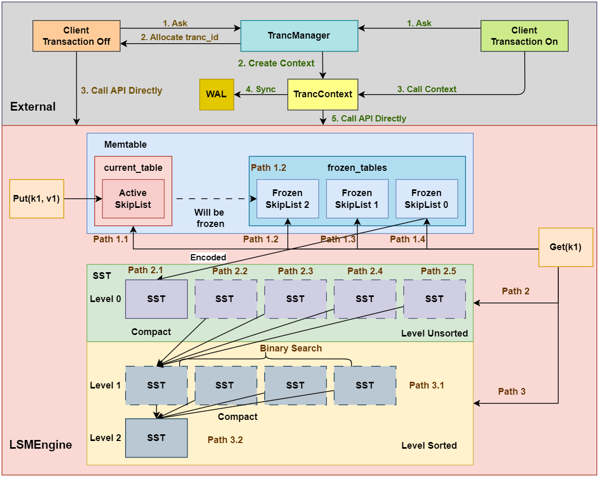

# Lab 5 事务 && MVCC && WAL
# 事务理论知识
本小节主要介绍事务的基本概念，事务的ACID特性，事务的隔离级别, 没有代码任务需要你完成。因此，如果你对这些内容已经熟悉，可以跳过本小节，直接进入下一节。

# 1 本小节目标
之前大家实现的各种函数中, 都是忽略了`tranc_id`这个参数的, 这一小节之后, `tranc_id`的神秘面纱将被揭开, 我们将学习事务的基础知识, 并修改之前所有的涉及`tranc_id`的函数, 使其能够支持事务特性。

首先给出本章实验后的架构示意图:

相比之前实现的`LSM Engine`的基础部分的[架构](../images/intro/tiny-lsm-arch.drawio.png), 这里新增了`TrancManager`、`WAL`、`TrancContext`杰哥模块, 其中`TrancManager`用于管理事务, `WAL`用于持久化事务操作, `TrancContext`用于与客户端进行直接交互。

# 2 KV存储中的事务
## 2.1 事务介绍
在数据库系统中，事务（Transaction）是指一组原子性操作的执行单元，需要满足ACID特性。这里简单介绍下`ACID`的基本性质:

| 特性                        | 定义                                                             | 技术实现                                                                           | KV存储中的特殊表现                                                                                    |
| --------------------------- | ---------------------------------------------------------------- | ---------------------------------------------------------------------------------- | ----------------------------------------------------------------------------------------------------- |
| **原子性** (Atomicity)   | 事务内的操作要么全部成功，要么全部失败，不存在中间状态。         | - WAL（Write-Ahead Logging） - 两阶段提交（2PC） - 操作回滚日志              | - 单键操作天然原子 - 跨键原子性需显式事务（如批量提交） - LSM-Tree依赖WAL保证崩溃恢复           |
| **一致性** (Consistency) | 事务执行后数据库必须保持预设的业务规则（如唯一性、完整性约束）。 | - 关系型：外键、触发器 - 声明式约束（DDL） - 事务回滚机制                    | - 业务逻辑一致性需应用层实现                                                                          |
| **隔离性** (Isolation)   | 并发事务相互隔离，避免脏读、不可重复读、幻读。                   | - 锁机制（悲观锁） - MVCC（多版本并发控制） - 快照隔离（Snapshot Isolation） | - 通常采用乐观锁（版本号校验） - 全局时间戳实现快照隔离 - 弱隔离级别常见（如Read Committed）    |
| **持久性** (Durability)  | 事务提交后，数据永久存储，即使系统崩溃也不丢失。                 | - 同步刷盘（`fsync`） - 副本复制（Replication） - 冗余存储（如RAID）         | - LSM-Tree依赖SSTable落盘 - 内存数据需通过WAL持久化 - 异步刷盘可能牺牲部分持久性（如Redis AOF） |

在这四个基本性质中, KV存储由于数据较为简单, 不存在类似关系型数据库中的外键、触发器、声明式约束等复杂业务规则, 因此一致性是比较容易实现的，基本上你实现了一致性、隔离性，一致性就自然满足了，这里我们探讨下其他几个形状在`KV存储`中的实现逻辑:

1. **原子性**：通过批量化操作即可, 可以将一个事务的操作先暂存起来, 在提交时统一应用到存储引擎的状态机中。
2. **隔离性**：这里涉及到隔离级别， 会在后面统一介绍。
3. **持久性**：`LSM-Tree`的持久化依赖`SSTable`落盘，但我们插入一些数据后, 这些数据肯定优先存在于内存中, 在内存容量达到阈值后才会刷盘, 为保证持久性, 可以用以下两个方案
   1. 事务提交后强制刷盘到`SST`, 但这样可能导致刷入的`L0 SST`大小过小, 加大了`L0 SST`合并时的计算量(后续章节介绍`compact`)
   2. 事务提交时先将操作写入`WAL`(`Write-Ahead Logging`), 同时存储引擎维护刷入`SST`的最大事务序号, 在重启或崩溃恢复时根据`WAL`重放操作(后续会介绍)

## 2.2 隔离级别
### 2.2.1 隔离级别的定义与分类
在并发事务场景下，隔离性通过不同的隔离级别实现不同程度的可见性控制。我们先回顾下关系型数据库中的隔离级别:
> 这里如果对这些隔离级别不熟悉, 建议先学下数据库的课程

| 隔离级别     | 脏读(Dirty Read) | 不可重复读(Non-Repeatable Read) | 幻读(Phantom Read) | 典型实现方案                                             |
| ------------ | ---------------- | ------------------------------- | ------------------ | -------------------------------------------------------- |
| **读未提交** | 允许             | 允许                            | 允许               | - 无版本控制 - 直接读取内存最新值                     |
| **读已提交** | 禁止             | 允许                            | 允许               | - 单版本快照 - 每次读获取最新提交版本                 |
| **可重复读** | 禁止             | 禁止                            | 允许               | - 多版本快照 - 事务级版本锚定（如MySQL InnoDB的MVCC） |
| **可串行化** | 禁止             | 禁止                            | 禁止               | - 严格锁机制 - 冲突范围检测（如FoundationDB）         |

> 注：快照隔离下幻读仍可能发生，但可通过追加范围锁避免

### 2.2.2 KV存储中事务冲突和隔离级别的案例
在LSM-Tree结构的KV存储中，我们举一个例子说明隔离级别和实物冲突的联系:

在下面的场景时序图, 事务按照创建的时间从小大大分配`ID`, 在这个

| Timeline | 事务A (ID=100)        | 事务B (ID=101)        | Key1状态           |
| -------- | --------------------- | --------------------- | ------------------ |
| T0       | Begin                 |                       | Version=0 (初始值) |
| T1       | Read Key1 (Version=0) | Begin                 |                    |
| T2       | Modify Key1→ValueA    | Read Key1 (Version=0) |                    |
| T3       |                       | Modify Key1→ValueB    |                    |
| T4       |                       | Commit ✅ (Version=1)  | Version=1 (ValueB) |
| T5       | Attempt Commit ❌      |                       | 检测到Key1已更新   |

在这个例子中, 更早创建的事务A和和更晚创建的事务B在读写了同一个`Key1`, 事务B先提交, 并且更新了`Key1`的值为`ValueB`, 事务A在提交后, 数据库中面临这样的问题: 以哪一个版本的修改为准?

以上问题就是一种事务冲突，在`KV存储`中，事务冲突的解决方式直接取决于**隔离级别**的设计。以下是不同隔离级别的处理差异：

| 隔离级别     | 事务A提交结果 | 原因                                                    | 最终Key1值 |
| ------------ | ------------- | ------------------------------------------------------- | ---------- |
| **读未提交** | ✅ 成功        | 允许覆盖未提交数据，但导致事务B的修改丢失（违反原子性） | ValueA     |
| **读已提交** | ❌ 中止        | 检测到Key1已提交新版本（Version=1 > 事务A的起始版本）   | ValueB     |
| **可重复读** | ❌ 中止        | 事务A的读快照锁定Version=0，但写冲突仍存在              | ValueB     |
| **可串行化** | ❌ 中止        | 通过范围锁阻止事务B写入，或强制事务串行执行             | ValueB     |

以上是`put`时是事务冲突, 基于这个案例, 同时有2个事务再去读取`key1`:

> 假设初始时刻 `Key1 = Value0`

| Timeline | 事务A (ID=100)     | 事务B (ID=101)     | 事务C (ID=102)         | 事务D (ID=103)         |
| -------- | ------------------ | ------------------ | ---------------------- | ---------------------- |
| T0       | Begin              |                    | Key1 = Value0 (初始值) | Key1 = Value0 (初始值) |
| T1       | Read Key1          | Begin              |                        |                        |
| T2       | Modify Key1→ValueA |                    | Begin                  |                        |
| T3       |                    |                    | Read Key1 (Version=❓)  |                        |
| T4       |                    | Read Key1          |                        |                        |
| T5       |                    | Modify Key1→ValueB |                        |                        |
| T6       |                    | Attempt Commit ❓   |                        |                        |
| T7       |                    |                    |                        | Begin                  |
| T8       |                    |                    | Read Key1 (Key1=❓)     | Read Key1 (Key1=❓)     |
| T9       | Attempt Commit ❓   |                    |                        |                        |
| T10      |                    |                    | Read Key1 (Key1=❓)     | Read Key1 (Key1=❓)     |

这个场景下, 在事务A和B操作时, 另外还存在2个事务C和D在读取`key1`的值, 事务C和D的读取结果是仍然取决于隔离级别:

#### **1. 读未提交（Read Uncommitted）**
允许读取未提交的中间值（包括可能回滚的脏数据）。

| 事务  | T3（C读取） | T8（C/D读取） | T10（C/D读取） | 事务提交结果 | 结果解释                                                                       |
| ----- | ----------- | ------------- | -------------- | ------------ | ------------------------------------------------------------------------------ |
| **A** | -           | -             | -              | ✅ 成功       | 不检测写冲突，直接覆盖事务B的提交（Key1=ValueA）                               |
| **B** | -           | -             | -              | ✅ 成功       | 事务B先提交（Key1=ValueB），但被事务A覆盖                                      |
| **C** | ValueA      | ValueB        | ValueA         | -            | T3读取事务A未提交的ValueA；T8时事务B已经提交，读ValueB；T10事务A提交后读ValueA |
| **D** | -           | ValueB        | ValueA         | -            | T8时事务A未提交，读ValueB；T10事务A提交后读ValueA                              |

**最终Key1值**：ValueA（事务A覆盖事务B）  
**风险**：事务B的合法提交被覆盖，数据一致性被破坏。

---

#### **2. 读已提交（Read Committed）**
仅读取已提交的数据，但同一事务内多次读取结果可能不同。

| 事务  | T3（C读取） | T8（C/D读取） | T10（C/D读取） | 事务提交结果            | 结果解释                                                                               |
| ----- | ----------- | ------------- | -------------- | ----------------------- | -------------------------------------------------------------------------------------- |
| **A** | -           | -             | -              | ✅ 成功  or  ❌中止 | 只确保读取时的数据是提交的, 但不确保提交时没有冲突, 取决于具体的实现                   |
| **B** | -           | -             | -              | ✅ 成功                  | 事务B提交成功（Key1=ValueB）                                                           |
| **C** | Value0      | ValueB        | ValueA         | -                       | T3时事务A/B均未提交，读Value0；T8时事务B已提交，读ValueB, 最后T10时事务A提交，读ValueA |
| **D** | -           | ValueB        | ValueA         | -                       | T8时事务B已提交，读ValueB, 最后T10时事务A提交，读ValueA                                |

**最终Key1值**：ValueA（事务A覆盖事务B）  
**风险**：事务B的合法提交被覆盖，数据一致性被破坏。
**相较于前者的优化**: 读取的数据一定是已经提交的数据

---

#### **3. 可重复读（Repeatable Read）**
基于首次读取时的值锚定，保证多次读取结果一致。

| 事务  | T3（C读取） | T8（C/D读取） | T10（C/D读取） | 事务提交结果 | 结果解释                                  |
| ----- | ----------- | ------------- | -------------- | ------------ | ----------------------------------------- |
| **A** | -           | -             | -              | ❌ 中止       | 提交时检测到Key1已被事务B修改             |
| **B** | -           | -             | -              | ✅ 成功       | 事务B提交成功（Key1=ValueB）              |
| **C** | Value0      | Value0        | Value0         | -            | 事务C首次读取锚定Value0，后续读取强制复用 |
| **D** | -           | ValueB        | ValueB         | -            | 事务D首次读取时事务B已提交，锚定ValueB    |

**最终Key1值**：ValueB  
**实现难点**：需在内存中维护事务首次读取的键值锚定表，防止Compaction清理旧版本。

---

#### **5. 可串行化（Serializable）**
通过锁机制强制事务串行执行，完全禁止并发冲突。

| 事务  | T3（C读取） | T8（C/D读取） | T10（C/D读取） | 事务提交结果 | 结果解释                                                         |
| ----- | ----------- | ------------- | -------------- | ------------ | ---------------------------------------------------------------- |
| **A** | -           | -             | -              | ❌ 中止       | 事务C持有Key1的共享锁，事务A尝试获取排他锁时被阻塞，最终超时中止 |
| **B** | -           | -             | -              | ✅ 成功       | 事务B在事务C释放锁后获取排他锁并提交                             |
| **C** | Value0      | Value0        | Value0         | -            | 事务C持有共享锁，保证读取一致性                                  |
| **D** | -           | ValueB        | ValueB         | -            | 事务D在事务B提交后读取ValueB                                     |

**最终Key1值**：ValueB  
**锁竞争时序**：事务C的共享锁阻塞事务A/B，事务B在事务C释放锁后提交。

---

通过这个案例, 我们可以复习下MVCC在读已提交和可重复读的区别:
1. 读已提交: 读取时，快照基于当前这一次操作的时间
2. 可重复读: 读取时，快照基于事务创建的时间

# 3 WAL简单介绍
`WAL`（Write-Ahead Logging）是一种常用的日志记录机制，用于确保在系统崩溃或故障恢复时，数据的一致性和完整性。`WAL`的核心思想是：在执行数据修改操作之前，首先将修改操作记录到日志中，然后再对数据进行修改。这样，即使系统在修改数据的过程中崩溃，也可以通过日志中的记录来恢复数据。

`WAl`主要是一种思想, 具体的日志编码格式、存储方式、检查恢复方式在不同数据库中差异很大，我们会在[Lab 5.3](./lab5.3-Record.md)中对本实验项目的`WAL`设计进行详细讲解。